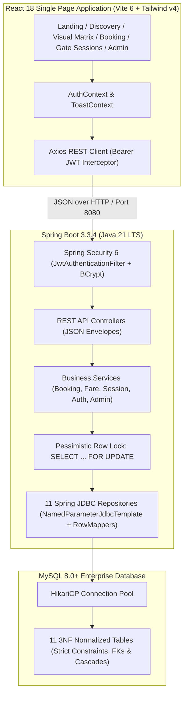

# Smart Parking Management & Booking Platform

[](https://www.oracle.com/java/)
[](https://spring.io/projects/spring-boot)
[](https://spring.io/projects/spring-framework)
[](https://react.dev/)
[](https://vitejs.dev/)
[](https://tailwindcss.com/)
[](https://www.mysql.com/)
[](https://jwt.io/)
[-brightgreen?style=flat-square)](file:///d:/Smart-Parking-System-master/docs/TESTING.md)

---

## 1. Executive Summary & Modernization

The **Smart Parking System** has undergone a ground-up modernization from an outdated 2017 Java 8 / Eclipse / Tomcat Servlet prototype into an enterprise-grade full-stack parking automation platform. 

### Legacy Deficiencies Eradicated
- **Pervasive SQL Injection**: Legacy servlets used raw string concatenation (`"SELECT * FROM place WHERE place_name = '" + pnum + "'"`). Replaced with parameterized **Spring JDBC (`NamedParameterJdbcTemplate`)** queries.
- **Servlet Thread-Safety Disasters**: Legacy servlets stored HTTP request parameters directly in singleton servlet instance fields (`String pnum; int lcode;`), resulting in state pollution across concurrent requests. Replaced with stateless Spring service components.
- **Double-Booking Race Conditions**: Legacy code performed unconstrained `INSERT` without row locks. Modernized with **pessimistic row locking (`SELECT ... FOR UPDATE`)** inside `@Transactional(isolation = Isolation.REPEATABLE_READ)` transactions, proven by automated `CyclicBarrier` concurrency tests.
- **Flawed Midnight Fare Math**: Legacy subtraction (`h - time_booked`) yielded negative hours when a parking session crossed midnight (e.g. 23:30 to 02:15). Modernized with monotonic `Duration.between()` logic, a 15-minute grace period waiver, ceiling-hour rounding, and overstay penalties.
- **Plaintext Credentials**: Legacy passwords were saved unencrypted. Modernized with **BCrypt (10 rounds)** hashing and **stateless JWT tokens**.
- **Modern User Experience**: The 2017 JSP UI has been replaced by a responsive, dark-themed **React 18 Single Page Application** built with Vite, Tailwind CSS v4, Lucide React, and Axios.

---

## 2. System Architecture



### Why Spring JDBC over JPA/Hibernate?
The backend deliberately utilizes **Spring JDBC (`JdbcTemplate` / `NamedParameterJdbcTemplate`)** with dedicated `RowMapper` implementations rather than heavy ORMs (JPA/Hibernate):
1. **Pessimistic Lock Precision**: Absolute, transparent control over `SELECT ... FOR UPDATE` locking behavior without unintended ORM session flushes or cache invalidations.
2. **Deterministic SQL Performance**: Zero hidden N+1 queries, zero lazy-initialization overhead, and optimal connection footprint.
3. **Audit & Query Clarity**: Every database interaction maps to explicit SQL in the repository layer.

---

## 3. Core Feature Highlights

- **Dual Booking Modes**:
  - **Park Now (Immediate)**: Instant allocation of an available bay with real-time transition to `RESERVED` status.
  - **Advance Booking**: Date-time window reservations with automatic slot conflict checking.
- **Interactive Visual Slot Matrix**:
  - Color-coded bays partitioned by floor and vehicle type (**Car, Bike, SUV, EV Charging**).
  - Live status indicators: **Available (Green)**, **Reserved (Yellow)**, **Occupied (Red)**, **Maintenance (Gray)**.
- **Precision Fare & Billing Engine**:
  - **15-Minute Grace Period**: Drop-offs or immediate exits (<15 mins) are 100% free of charge.
  - **1-Hour Minimum**: Transparent entry fee with ceiling-hour rounding (e.g. 75 mins = 2 billable hours).
  - **Midnight Crossings**: Handles multi-day or overnight parkings without sign errors.
  - **Overstay Penalty Multiplier**: Automatic penalty billing for parking past the booked checkout window.
  - **Vehicle-Specific Tariffs**: Tailored pricing rules per vehicle category.
- **Gate Check-in & Digital Checkout Receipts**:
  - Physical entry gate QR / reference check-in transitioning bays to `OCCUPIED`.
  - Exit gate checkout with immediate payment processing (UPI, Credit/Debit Card, Cash, FASTag) and digital invoice receipt generation.
- **Multi-Vehicle Garage**:
  - Customers can register multiple vehicles (Car, Bike, SUV, EV) and set a default vehicle.
  - Automatic validation preventing vehicles from being booked into mismatched bays (e.g. SUVs in Bike spots).
- **Admin Command Center**:
  - Real-time lot utilization metrics, active session tracking, revenue aggregation, and slot status overrides.
- **Bangalore Urban Heritage**:
  - Honoring the system's roots with seeded locations across Bangalore hubs: **Yeshwantpur Junction**, **Indiranagar 100ft Road**, **Malleshwaram 8th Cross**, **Yelahanka New Town**, **Koramangala Tech Hub**, and the **MSRIT Mathikere Hub**.

---

## 4. Technology Stack

| Domain | Technology | Version / Purpose |
|---|---|---|
| **Runtime & Language** | Java (OpenJDK) | **21 LTS** |
| **Backend Framework** | Spring Boot | **3.3.4** |
| **Data Access** | Spring JDBC + HikariCP | Direct SQL with custom RowMappers |
| **Security & Auth** | Spring Security 6 + JJWT | **0.12.6** (Stateless Bearer JWT, BCrypt) |
| **Frontend Framework** | React | **18.3.1** (Modern JavaScript / JSX only) |
| **Frontend Tooling** | Vite | **6.x** / Fast HMR & ESBuild bundling |
| **Styling & Icons** | Tailwind CSS + Lucide React | **v4.0** with Lucide vector icons |
| **HTTP Client** | Axios | **1.7.9** with automated auth interceptor |
| **Database Engine** | MySQL | **8.0+** (In-memory H2 MySQL mode for tests) |
| **Testing** | JUnit 5 + Spring Boot Test | Multithreaded concurrency & lifecycle tests |

---

## 5. Prerequisites & Quickstart

### Prerequisites
- **JDK 21 LTS** installed and available on `PATH` (`java -version`)
- **Node.js 20+** and `npm` installed (`node -v`)
- **MySQL 8.0+** running locally (or use Docker / XAMPP)

---

### Step 1: Initialize Database
Open your MySQL client (MySQL Workbench, DBeaver, or command line) and run the provided SQL scripts:

```bash
# 1. Create normalized 11-table schema
mysql -u root -p < database/schema.sql

# 2. Seed roles, users, Bangalore locations, lots, pricing rules, and slots
mysql -u root -p < database/seed.sql
```

> **Note**: For MySQL connection credentials, verify or edit `backend/src/main/resources/application.yml` (default: user `root`, password `root`, database `smart_parking_db` on port `3306`).

---

### Step 2: Start the Backend Service
From the repository root:

```bash
# Windows
cd backend
.\mvnw.cmd spring-boot:run

# Linux / macOS
cd backend
./mvnw spring-boot:run
```

The Spring Boot backend will start on **`http://localhost:8080`**.  
Verify health by visiting: [`http://localhost:8080/api/health`](http://localhost:8080/api/health)

---

### Step 3: Start the Frontend Application
From the repository root in a separate terminal:

```bash
cd frontend
npm install
npm run dev
```

The React Single Page Application will start on **`http://localhost:5173`**.  
Open [http://localhost:5173](http://localhost:5173) in your browser.

---

## 6. Demo & Seed Credentials

The database comes pre-seeded with the following accounts for immediate testing:

| Role | Email Address | Password | Description |
|---|---|---|---|
| **System Admin** | `admin@smartparking.com` | `User@123` *(or `Admin@123`)* | Full administrative access, analytics, user & lot oversight |
| **Customer 1** | `john.doe@example.com` | `User@123` | Pre-loaded with Car (KA-01-AB-1234) & Bike (KA-01-XY-9876) |
| **Customer 2** | `jane.smith@example.com` | `User@123` | Pre-loaded with Car (KA-03-MN-4567) & EV (KA-03-EV-0001) |
| **Customer 3** | `rahul.sharma@example.com` | `User@123` | Pre-loaded with SUV (KA-04-GH-7890) & Bike (KA-04-BK-3344) |

*You can also register any new account instantly via the frontend registration page.*

---

## 7. REST API Endpoints Overview

All protected endpoints require the HTTP header: `Authorization: Bearer <JWT_TOKEN>`.

| Method | Endpoint | Access | Description |
|---|---|:---:|---|
| `POST` | `/api/auth/register` | Public | Register a new customer account |
| `POST` | `/api/auth/login` | Public | Authenticate user & return JWT token |
| `GET` | `/api/auth/me` | Authenticated | Retrieve current user profile |
| `GET` | `/api/users/profile` | Authenticated | Retrieve user profile details |
| `PUT` | `/api/users/profile` | Authenticated | Update user profile details |
| `GET` | `/api/locations` | Public | List all active parking locations |
| `GET` | `/api/locations/{id}/lots`| Public | List parking lots under a location |
| `GET` | `/api/lots` | Public | List all parking lots (with location & capacity) |
| `GET` | `/api/lots/{id}` | Public | Get detailed lot information & pricing rules |
| `GET` | `/api/lots/{id}/slots` | Public | Get real-time slot matrix layout |
| `GET` | `/api/lots/{id}/availability`| Public| Get slot occupancy & vehicle breakdown |
| `GET` | `/api/vehicles` | Authenticated | List all vehicles owned by authenticated user |
| `POST` | `/api/vehicles` | Authenticated | Register a new vehicle |
| `PUT` | `/api/vehicles/{id}` | Authenticated | Update vehicle information |
| `DELETE`| `/api/vehicles/{id}` | Authenticated | Delete vehicle from garage |
| `POST` | `/api/bookings` | Authenticated | Create booking (**Pessimistic lock protected**) |
| `GET` | `/api/bookings` | Authenticated | List bookings for current user |
| `GET` | `/api/bookings/{id}` | Authenticated | Get booking details |
| `PUT` | `/api/bookings/{id}/cancel`| Authenticated | Cancel a booking and release slot |
| `POST` | `/api/sessions/{bookingId}/start`| Authenticated| Gate check-in & start session (marks slot `OCCUPIED`) |
| `GET` | `/api/sessions/active` | Authenticated | Retrieve user's current active session |
| `POST` | `/api/sessions/{sessionId}/end`| Authenticated| Gate check-out & precision fare calculation |
| `GET` | `/api/admin/stats` | Admin | Real-time aggregate KPIs (users, lots, slots, revenue) |
| `GET` | `/api/admin/users` | Admin | View user accounts and roles |
| `GET/POST/PUT/DELETE`| `/api/admin/locations`| Admin | Urban location management |
| `GET/POST/PUT/DELETE`| `/api/admin/lots` | Admin | Parking facility management |
| `GET/POST/DELETE`| `/api/admin/slots` | Admin | Bay creation and deletion |
| `PUT` | `/api/admin/slots/{id}/status`| Admin | Bay maintenance and operational controls |
| `GET/PUT`| `/api/admin/bookings` | Admin | Booking audit and administrative cancellation |
| `GET/POST/PUT/DELETE`| `/api/admin/pricing` | Admin | Vehicle tariff and pricing rules management |
| `GET` | `/api/admin/audit-logs`| Admin | System audit trail inspection |
| `GET` | `/api/health` | Public | System health and uptime |

*For complete request/response schemas and curl examples, see [`docs/API.md`](file:///d:/Smart-Parking-System-master/docs/API.md).*

---

## 8. Automated Testing & Verification

The platform includes a test suite covering repository operations, JWT authentication, RBAC authorization, precision fare calculations, and multithreaded booking race conditions.

```bash
# Run backend test suite (38 tests)
cd backend
.\mvnw.cmd test

# Run specific concurrency barrier test
.\mvnw.cmd test -Dtest=BookingConcurrencyIntegrationTest

# Validate frontend production build
cd frontend
npm run build
```

### Test Results
```
[INFO] Tests run: 38, Failures: 0, Errors: 0, Skipped: 0
[INFO] BUILD SUCCESS
```

*For comprehensive testing methodology, see [`docs/TESTING.md`](file:///d:/Smart-Parking-System-master/docs/TESTING.md).*

---

## 9. Comprehensive Documentation Index

| Document | Purpose & Key Topics |
|---|---|
| [`docs/ARCHITECTURE.md`](file:///d:/Smart-Parking-System-master/docs/ARCHITECTURE.md) | Architectural blueprint, layers, component flows, design decisions, and data access. |
| [`docs/API.md`](file:///d:/Smart-Parking-System-master/docs/API.md) | Full REST API specification with endpoints, request bodies, responses, and error codes. |
| [`docs/BOOKING_CONCURRENCY.md`](file:///d:/Smart-Parking-System-master/docs/BOOKING_CONCURRENCY.md) | In-depth analysis of pessimistic locking (`SELECT ... FOR UPDATE`) and race condition defense. |
| [`docs/DATABASE.md`](file:///d:/Smart-Parking-System-master/docs/DATABASE.md) | Relational database schema reference, 3NF design, 11 tables, constraints, and indexes. |
| [`docs/SECURITY.md`](file:///d:/Smart-Parking-System-master/docs/SECURITY.md) | Security design, JWT token life-cycle, BCrypt hashing, and role-based access control. |
| [`docs/TESTING.md`](file:///d:/Smart-Parking-System-master/docs/TESTING.md) | Automated testing strategy, concurrency barriers, fare unit tests, and coverage matrix. |
| [`docs/MIGRATION.md`](file:///d:/Smart-Parking-System-master/docs/MIGRATION.md) | 16-phase migration roadmap from legacy Java Servlets to modern Spring Boot & React. |
| [`docs/PROJECT_ANALYSIS.md`](file:///d:/Smart-Parking-System-master/docs/PROJECT_ANALYSIS.md) | Forensic security and structural audit of original 2017 legacy code. |

---

## 10. Project Directory Layout

```
Smart-Parking-System-master/
├── backend/                             # Spring Boot 3.3.4 (Java 21 LTS)
│   ├── src/main/java/com/smartparking/
│   │   ├── config/                      # SecurityConfig, CorsConfig, PasswordEncoder
│   │   ├── controller/                  # Auth, Booking, Session, Vehicle, Lot, Admin
│   │   ├── dto/                         # Request & Response DTOs
│   │   ├── exception/                   # AppException, GlobalExceptionHandler
│   │   ├── model/                       # Domain entities & Enums
│   │   ├── repository/                  # 11 Spring JDBC repositories with RowMappers
│   │   ├── security/                    # JwtTokenProvider, JwtAuthenticationFilter
│   │   └── service/                     # Booking, Fare, Session, Auth, Admin services
│   ├── src/main/resources/              # application.yml
│   └── src/test/                        # 38 Automated Tests (H2 in-memory MySQL mode)
├── frontend/                            # React 18 SPA (Vite 6, Tailwind CSS v4, JSX)
│   ├── src/
│   │   ├── api/                         # Axios client & domain API modules
│   │   ├── components/                  # Navbar, Footer, SlotCard, SlotMatrix, Modals
│   │   ├── context/                     # AuthContext, ToastContext
│   │   ├── pages/                       # FindParking, LotView, MyBookings, GateSession, Admin
│   │   ├── App.jsx                      # Protected routing
│   │   └── main.jsx                     # Application bootstrap
│   └── package.json
├── database/                            # Database DDL & Data
│   ├── schema.sql                       # 11 normalized tables (MySQL 8+)
│   ├── seed.sql                         # Pre-loaded Bangalore locations, lots, rules, users
│   └── README.md
├── docs/                                # Technical Architecture & Specification Guides
│   ├── ARCHITECTURE.md
│   ├── API.md
│   ├── BOOKING_CONCURRENCY.md
│   ├── DATABASE.md
│   ├── SECURITY.md
│   ├── TESTING.md
│   ├── MIGRATION.md
│   └── PROJECT_ANALYSIS.md
└── README.md                            # Project Overview (This file)
```

---

## 11. License & Academic Attribution
Originally conceptualized as an academic Java & DBMS course project at **M.S. Ramaiah Institute of Technology (MSRIT), Mathikere, Bangalore**. Modernized into an enterprise-grade platform in 2026.
