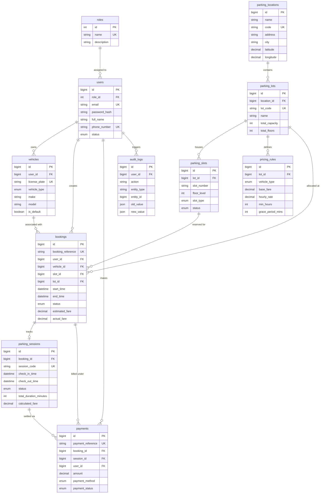

# Relational Database Architecture: Smart Parking System

## 1. Executive Summary & Design Principles

This document specifies the relational database architecture for the modernized **Smart Parking System**. Designed for **MySQL 8.0+** using the **InnoDB** storage engine, the schema achieves:
1. **Third Normal Form (3NF)**: Minimizes data redundancy and eliminates update/insertion anomalies.
2. **Strict Referential Integrity**: Enforces relationships via foreign keys with explicit cascade and restrict policies.
3. **Database-Level Constraint Enforcement**: Does not rely solely on application or frontend validation; utilizes `CHECK` constraints, `UNIQUE` keys, and `NOT NULL` definitions.
4. **Pessimistic Concurrency Readiness**: Supports sub-millisecond slot locking and overlap lookups via optimized composite indexes.
5. **Spring JDBC Compatibility**: Designed for high-throughput, explicit mapping with `JdbcTemplate` and custom `RowMapper` classes, strictly avoiding JPA/Hibernate overhead.

---

## 2. Entity-Relationship (ER) Model

### 2.1 Visual Mermaid Diagram


---

## 3. Core Business Relationships

### 3.1 User-to-Payment Lifecycle Chain
$$\text{User} \xrightarrow{\text{1:N}} \text{Vehicles} \xrightarrow{\text{1:N}} \text{Bookings} \xrightarrow{\text{1:1}} \text{Parking Sessions} \xrightarrow{\text{1:N}} \text{Payments}$$

- A **User** registers multiple **Vehicles** (unlike the legacy system which forced exactly one vehicle during signup).
- A **User** initiates a **Booking** by associating a selected **Vehicle** with an available **Parking Slot**.
- When the user drives into the parking facility, the confirmed booking spawns an active **Parking Session**.
- When checking out, a **Payment** ledger record is generated, referencing both the parent **Booking** and the physical **Parking Session**.

### 3.2 Facility-to-Reservation Hierarchy
$$\text{Parking Location} \xrightarrow{\text{1:N}} \text{Parking Lots} \xrightarrow{\text{1:N}} \text{Parking Slots} \xrightarrow{\text{1:N}} \text{Bookings}$$

- A **Parking Location** defines a regional district (e.g. Yeshwantpur, Indiranagar).
- Each location contains multiple facilities (**Parking Lots**).
- Each lot houses individual physical bays (**Parking Slots**), uniquely numbered within the facility (e.g., `A-01`, `B-04`).
- Bookings reference the slot and its parent lot, ensuring fast filtering by lot while enforcing granular bay reservations.

---

## 4. State Machines & Status Transitions

### 4.1 Booking Status Lifecycle
The `bookings.status` field governs the reservation lifecycle:

```
                  +-----------+
                  |  PENDING  |
                  +-----+-----+
                        |
            Payment / Confirmation OK
                        |
                        v
                  +-----------+
        +-------->| CONFIRMED |<--------+
        |         +-----+-----+         |
  Auto-Expired          |          User Cancels
  (No show)             | Check-in      |
        v               v               v
  +-----------+   +-----------+   +-----------+
  |  EXPIRED  |   |  ACTIVE   |   | CANCELLED |
  +-----------+   +-----+-----+   +-----------+
                        |
                    Check-out
                        |
                        v
                  +-----------+
                  | COMPLETED |
                  +-----------+
```

| State | Description | Allowed Next States |
|---|---|---|
| `PENDING` | Booking request submitted, awaiting confirmation. | `CONFIRMED`, `CANCELLED` |
| `CONFIRMED` | Slot successfully reserved for the timeframe. | `ACTIVE`, `CANCELLED`, `EXPIRED` |
| `ACTIVE` | Customer vehicle has checked in at the lot. | `COMPLETED` |
| `COMPLETED` | Customer has checked out and settled charges. | *Terminal state* |
| `CANCELLED` | Booking revoked prior to check-in. | *Terminal state* |
| `EXPIRED` | Customer failed to arrive within grace period. | *Terminal state* |

### 4.2 Parking Slot Status
The `parking_slots.status` field represents the physical condition of the bay:

| Status | Meaning | Can Be Booked? |
|---|---|---|
| `AVAILABLE` | The bay is open and ready for parking or reservation. | **Yes** |
| `RESERVED` | Allocated for an upcoming confirmed reservation. | Only for non-overlapping windows |
| `OCCUPIED` | A vehicle is physically parked in the slot. | **No** |
| `MAINTENANCE`| Out of order (e.g., sensor repair, repainting, resurfacing). | **No** |
| `DISABLED` | Administratively deactivated from the facility layout. | **No** |

---

## 5. Detailed Table Specifications

### 5.1 `roles`
System authority levels.
- `id` (INT, PK, AUTO_INCREMENT)
- `name` (VARCHAR(50), NOT NULL, UNIQUE) — e.g. `ROLE_ADMIN`, `ROLE_CUSTOMER`
- `description` (VARCHAR(255), NULL)
- `created_at` (TIMESTAMP, NOT NULL, DEFAULT CURRENT_TIMESTAMP)

### 5.2 `users`
Customer and administrator credentials.
- `id` (BIGINT, PK, AUTO_INCREMENT)
- `role_id` (INT, NOT NULL, FK -> `roles.id` RESTRICT)
- `email` (VARCHAR(150), NOT NULL, UNIQUE)
- `password_hash` (VARCHAR(255), NOT NULL) — 60-character BCrypt hash
- `full_name` (VARCHAR(100), NOT NULL)
- `phone_number` (VARCHAR(20), NOT NULL, UNIQUE)
- `status` (ENUM('ACTIVE', 'SUSPENDED', 'DEACTIVATED'), NOT NULL, DEFAULT 'ACTIVE')
- `created_at`, `updated_at` (TIMESTAMP)

### 5.3 `vehicles`
User vehicles with type classifications.
- `id` (BIGINT, PK, AUTO_INCREMENT)
- `user_id` (BIGINT, NOT NULL, FK -> `users.id` CASCADE)
- `license_plate` (VARCHAR(20), NOT NULL, UNIQUE)
- `vehicle_type` (ENUM('CAR', 'BIKE', 'SUV', 'EV', 'TRUCK'), NOT NULL, DEFAULT 'CAR')
- `make` (VARCHAR(50), NULL)
- `model` (VARCHAR(50), NULL)
- `color` (VARCHAR(30), NULL)
- `is_default` (BOOLEAN, NOT NULL, DEFAULT FALSE)
- `created_at`, `updated_at` (TIMESTAMP)

### 5.4 `parking_locations`
Districts and geographic zones.
- `id` (BIGINT, PK, AUTO_INCREMENT)
- `name` (VARCHAR(100), NOT NULL)
- `code` (VARCHAR(20), NOT NULL, UNIQUE) — e.g. `LOC-YSH`
- `address` (VARCHAR(255), NOT NULL)
- `city` (VARCHAR(100), NOT NULL, DEFAULT 'Bangalore')
- `state` (VARCHAR(100), NOT NULL, DEFAULT 'Karnataka')
- `postal_code` (VARCHAR(20), NOT NULL)
- `latitude` (DECIMAL(10, 8), NULL), `longitude` (DECIMAL(11, 8), NULL)
- `image_url` (VARCHAR(255), NULL)
- `is_active` (BOOLEAN, NOT NULL, DEFAULT TRUE)
- `created_at`, `updated_at` (TIMESTAMP)

### 5.5 `parking_lots`
Physical parking facilities.
- `id` (BIGINT, PK, AUTO_INCREMENT)
- `location_id` (BIGINT, NOT NULL, FK -> `parking_locations.id` RESTRICT)
- `lot_code` (VARCHAR(20), NOT NULL, UNIQUE) — e.g. `LOT-YSH-01`
- `name` (VARCHAR(100), NOT NULL)
- `total_capacity` (INT, NOT NULL, CHECK >= 0)
- `total_floors` (INT, NOT NULL, CHECK >= 1)
- `operating_hours` (VARCHAR(100), NOT NULL, DEFAULT '24/7')
- `contact_phone` (VARCHAR(20), NULL)
- `image_url` (VARCHAR(255), NULL)
- `is_active` (BOOLEAN, NOT NULL, DEFAULT TRUE)
- `created_at`, `updated_at` (TIMESTAMP)

### 5.6 `pricing_rules`
Tariffs per lot and vehicle type.
- `id` (BIGINT, PK, AUTO_INCREMENT)
- `lot_id` (BIGINT, NOT NULL, FK -> `parking_lots.id` CASCADE)
- `vehicle_type` (ENUM('CAR', 'BIKE', 'SUV', 'EV', 'TRUCK'), NOT NULL)
- `base_fare` (DECIMAL(10, 2), NOT NULL, CHECK >= 0)
- `hourly_rate` (DECIMAL(10, 2), NOT NULL, CHECK >= 0)
- `min_hours` (INT, NOT NULL, DEFAULT 1, CHECK >= 1)
- `grace_period_mins` (INT, NOT NULL, DEFAULT 15, CHECK >= 0)
- `overstay_penalty_rate` (DECIMAL(10, 2), NOT NULL, DEFAULT 0.00, CHECK >= 0)
- `is_active` (BOOLEAN, NOT NULL, DEFAULT TRUE)
- `created_at`, `updated_at` (TIMESTAMP)
- Unique Key: `(lot_id, vehicle_type)`

### 5.7 `parking_slots`
Individual parking bays.
- `id` (BIGINT, PK, AUTO_INCREMENT)
- `lot_id` (BIGINT, NOT NULL, FK -> `parking_lots.id` CASCADE)
- `slot_number` (VARCHAR(20), NOT NULL)
- `floor_level` (INT, NOT NULL, DEFAULT 1)
- `slot_type` (ENUM('CAR', 'BIKE', 'SUV', 'EV', 'TRUCK'), NOT NULL, DEFAULT 'CAR')
- `status` (ENUM('AVAILABLE', 'RESERVED', 'OCCUPIED', 'MAINTENANCE', 'DISABLED'), NOT NULL, DEFAULT 'AVAILABLE')
- `is_active` (BOOLEAN, NOT NULL, DEFAULT TRUE)
- `created_at`, `updated_at` (TIMESTAMP)
- Unique Key: `(lot_id, slot_number)`

### 5.8 `bookings`
Reservation records.
- `id` (BIGINT, PK, AUTO_INCREMENT)
- `booking_reference` (VARCHAR(40), NOT NULL, UNIQUE)
- `user_id` (BIGINT, NOT NULL, FK -> `users.id` RESTRICT)
- `vehicle_id` (BIGINT, NOT NULL, FK -> `vehicles.id` RESTRICT)
- `slot_id` (BIGINT, NOT NULL, FK -> `parking_slots.id` RESTRICT)
- `lot_id` (BIGINT, NOT NULL, FK -> `parking_lots.id` RESTRICT)
- `start_time` (DATETIME, NOT NULL)
- `end_time` (DATETIME, NOT NULL, CHECK `end_time > start_time`)
- `status` (ENUM('PENDING', 'CONFIRMED', 'ACTIVE', 'COMPLETED', 'CANCELLED', 'EXPIRED'), NOT NULL, DEFAULT 'PENDING')
- `estimated_fare` (DECIMAL(10, 2), NOT NULL, CHECK >= 0)
- `actual_fare` (DECIMAL(10, 2), NULL, CHECK >= 0)
- `cancellation_reason` (VARCHAR(255), NULL)
- `cancelled_at` (DATETIME, NULL)
- `created_at`, `updated_at` (TIMESTAMP)

### 5.9 `parking_sessions`
Physical check-in and check-out logs.
- `id` (BIGINT, PK, AUTO_INCREMENT)
- `booking_id` (BIGINT, NOT NULL, UNIQUE, FK -> `bookings.id` RESTRICT)
- `session_code` (VARCHAR(40), NOT NULL, UNIQUE)
- `check_in_time` (DATETIME, NOT NULL)
- `check_out_time` (DATETIME, NULL)
- `status` (ENUM('ACTIVE', 'COMPLETED', 'OVERSTAY'), NOT NULL, DEFAULT 'ACTIVE')
- `total_duration_minutes` (INT, NULL, CHECK >= 0)
- `calculated_fare` (DECIMAL(10, 2), NOT NULL, DEFAULT 0.00, CHECK >= 0)
- `overstay_penalty` (DECIMAL(10, 2), NOT NULL, DEFAULT 0.00, CHECK >= 0)
- `entry_gate` (VARCHAR(50), NULL), `exit_gate` (VARCHAR(50), NULL)
- `created_at`, `updated_at` (TIMESTAMP)

### 5.10 `payments`
Financial transactions.
- `id` (BIGINT, PK, AUTO_INCREMENT)
- `payment_reference` (VARCHAR(40), NOT NULL, UNIQUE)
- `booking_id` (BIGINT, NOT NULL, FK -> `bookings.id` RESTRICT)
- `session_id` (BIGINT, NULL, FK -> `parking_sessions.id` RESTRICT)
- `user_id` (BIGINT, NOT NULL, FK -> `users.id` RESTRICT)
- `amount` (DECIMAL(10, 2), NOT NULL, CHECK >= 0)
- `payment_method` (ENUM('CREDIT_CARD', 'DEBIT_CARD', 'UPI', 'NET_BANKING', 'CASH', 'WALLET'), NOT NULL, DEFAULT 'UPI')
- `payment_status` (ENUM('PENDING', 'COMPLETED', 'FAILED', 'REFUNDED'), NOT NULL, DEFAULT 'PENDING')
- `transaction_id` (VARCHAR(100), NULL)
- `paid_at` (DATETIME, NULL)
- `created_at`, `updated_at` (TIMESTAMP)

### 5.11 `audit_logs`
System security and operations ledger.
- `id` (BIGINT, PK, AUTO_INCREMENT)
- `user_id` (BIGINT, NULL, FK -> `users.id` SET NULL)
- `action` (VARCHAR(100), NOT NULL)
- `entity_type` (VARCHAR(50), NOT NULL)
- `entity_id` (BIGINT, NULL)
- `old_value` (JSON, NULL)
- `new_value` (JSON, NULL)
- `ip_address` (VARCHAR(45), NULL)
- `user_agent` (VARCHAR(255), NULL)
- `created_at` (TIMESTAMP, NOT NULL, DEFAULT CURRENT_TIMESTAMP)

---

## 6. Strategic Indexing Plan

| Table | Index Name | Columns Indexed | Query Target / Justification |
|---|---|---|---|
| `bookings` | `idx_bookings_slot_status_interval` | `(slot_id, status, start_time, end_time)` | **Core Concurrency Index**: Resolves slot availability and prevents double booking under sub-millisecond query windows. |
| `bookings` | `idx_bookings_user_status` | `(user_id, status)` | Fast retrieval of user's active, upcoming, and past bookings. |
| `bookings` | `idx_bookings_lot_status` | `(lot_id, status)` | Admin dashboard lot-level booking counters. |
| `parking_slots` | `idx_parking_slots_lot_status` | `(lot_id, status)` | Fast rendering of lot occupancy ratios. |
| `parking_slots` | `idx_parking_slots_lot_type_status` | `(lot_id, slot_type, status)` | Visual grid query filtering by vehicle category (e.g., Cars on Floor 1, Bikes on Floor 2). |
| `parking_lots` | `idx_parking_lots_location` | `(location_id)` | Fast lookup of lots when exploring a location. |
| `vehicles` | `idx_vehicles_user_id` | `(user_id)` | Fast lookup of user vehicle dropdown in booking modal. |
| `pricing_rules` | `idx_pricing_lot` | `(lot_id)` | Fare calculator rate resolution per facility. |
| `payments` | `idx_payments_user_status` | `(user_id, payment_status)` | User payment and transaction history. |
| `audit_logs` | `idx_audit_logs_entity` | `(entity_type, entity_id)` | Entity lifecycle auditing and security investigation. |

---

## 7. Spring JDBC Implementation Mapping (No JPA/Hibernate)

All persistence operations will utilize Spring JDBC (`JdbcTemplate` / `NamedParameterJdbcTemplate`) with explicit SQL statements and typed `RowMapper<T>` classes:

```java
// Example: Slot RowMapper implementation for Spring JDBC
public class ParkingSlotRowMapper implements RowMapper<ParkingSlot> {
    @Override
    public ParkingSlot mapRow(ResultSet rs, int rowNum) throws SQLException {
        ParkingSlot slot = new ParkingSlot();
        slot.setId(rs.getLong("id"));
        slot.setLotId(rs.getLong("lot_id"));
        slot.setSlotNumber(rs.getString("slot_number"));
        slot.setFloorLevel(rs.getInt("floor_level"));
        slot.setSlotType(VehicleType.valueOf(rs.getString("slot_type")));
        slot.setStatus(SlotStatus.valueOf(rs.getString("status")));
        slot.setActive(rs.getBoolean("is_active"));
        slot.setCreatedAt(rs.getTimestamp("created_at").toLocalDateTime());
        slot.setUpdatedAt(rs.getTimestamp("updated_at").toLocalDateTime());
        return slot;
    }
}
```

This guarantees zero ORM magic, full control over SQL execution plans, deterministic locking behaviors, and maximum runtime throughput.
